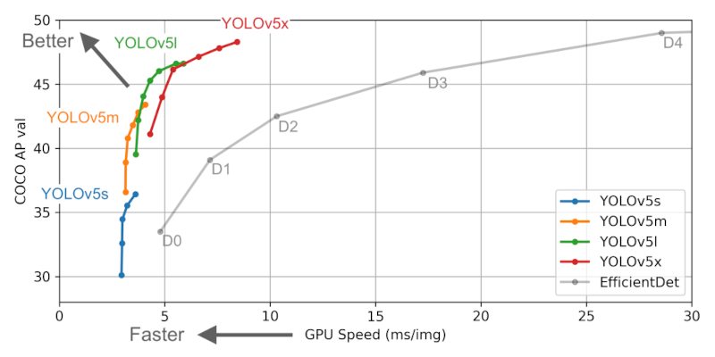
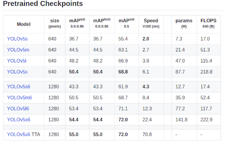
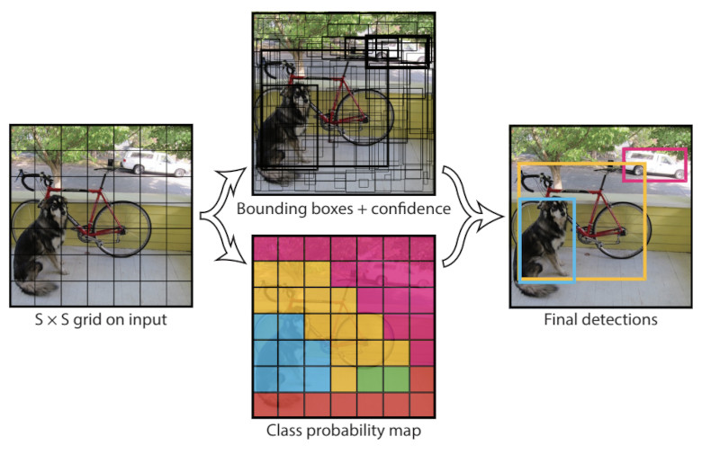

# Deep Learning based Signature Detection (YOLOv5x)
## Introduction

In the modern, rapidly developing world, where all spheres of human life are actively digitized, the problem of interaction with a large number of documents is quite acute. Yes, in the XIX and XX century, the accountant's vacancy was considered fashionable and prestigious, because there were very few qualified specialists, and their work was evaluated quite highly. But times are changing, technologies are developing, and people are tired of doing the same type of work on their own. Therefore, by automating this process, it would be possible to save a significant amount of time and qualified resources. This project is part of a large system for obtaining named entities from documents.

## Theory

Initially, I was thinking about developing my own signature detection model. But since this is only a small part of the project and the quality of detecting the boundaries of an object is not as important to me as the fact of its presence. Then I decided to use a ready-made pre-trained model. Among popular architectures, I considered YOLOv5x to be the simplest and most convenient option. If you pay attention to the graph below, you can see that YOLOv5x shows the best accuracy results compared to YOLOv5l, YOLOv5m, YOLOv5s.



Speaking more seriously, YOLOv5 is a modern object detection algorithm that is widely used both in scientific circles and in industry. This is the latest version of a universal and powerful object detection algorithm called YOLO. It surpasses all other real-time object detection models in the world.
YOLO uses convolutional neural networks instead of the region-based methods employed by alogorithms like R-CNN. The convolutional network Only Look Once, ie it requires only one forward pass through the neural network to make predictions. It makes two predictions, the class of object and the position of the objects present in the image.



YOLO devices an image into nine regions and predicts whether a target class is present in each region or not. It also predicts the bounding box coordinates of the target class. Non-max suppression is used to prevent same object being detected multiple times.



The original YOLO paper could be accessed [here](https://arxiv.org/abs/1506.02640) and YOLOv5 repo could be found [here](https://github.com/ultralytics/yolov5).

## Workflow

In machine learning , the process of creating a model is usually divided into the following steps:
* [Data preparation](Step_1_Convertiong_Dataset_to_YOLOv5)
  * Data collection / Dataset search
  * Clearing data
  * Data preparation / Data markup
  * Splitting the available data into training, validation and test samples
* [Model](Step_2_Custom_YOLO_training)
  * Selection (implementation) of the model architecture
  * Model Training
  * Model Test
* [Deployment](Step_3_Usage)
  * Preparing the model for further use

### [Data preparation](Step_1_Convertiong_Dataset_to_YOLOv5)
### [Training the model](Step_2_Custom_YOLO_training)

Use [this notebook](Step_2_Custom_YOLO_training/CustomYOLOv5_using_Tobcco800_dataset.ipynb) to train and test the YOLOv5 model.
  
Clone the official [YOLOv5 repo](https://github.com/ultralytics/yolov5) and install the requirements using the `requirements.txt` file.  
We need to create a `tobacco_data.yaml` and add the path of training `train:` and validation `valid:` directories, number of classes `nc:` and class names `['DLLogo', 'DLSignature']` and add this file to the `yolov5` directory we cloned.  
 
**Training arguments**  
`--img 640` is the width of the images.  
`--batch` - batch size
`--epochs` - no of epochs  
`--data` - Your path to `tobacco_data.yaml`  
`--cfg models/model.yaml` is used to set the model we want to train on. I have used yolov5x.yaml, more information could be found [here.](https://github.com/ultralytics/yolov5#pretrained-checkpoints)  
`--name` - The folder where the weights of the model will be saved

**To Train the model, run the following line.**  
> **!python yolov5/train.py --img 640 --batch 16 --epochs 300 --data tobacco_data.yaml --cfg models/yolov5x.yaml --name Tobacco-run**

**Testing/ Inference arguments**  
`--hide-labels` is used to hide the labels in the detected images.  
`--hide-conf` is used to hide the confidence scores in the detected images.  
`--classes 0, 1`, etc used to detect only the classes mentioned here. For our use case we need only signature class, so use `--classes 1`.  
`--line-thickness` integer used to set the thickness of bounding box.  
`--save-crop` and `--save-txt` used to save the crops and labels.  
`--project` could be used to specify the results path  
  
**To test/run inference on a directory of images.**  
> **!python yolov5/detect.py --source /images/valid/ --weights 'runs/train/Tobacco-run/weights/model.pt' --hide-labels --hide-conf --classes 1 --line-thickness 2**

**To pedict a single image**  
> **!python yolov5/detect.py --source /images/valid/imagename --weights 'runs/train/Tobacco-run/weights/model.pt' --hide-labels --hide-conf --classes 1 --line-thickness 2**  
   

### [Deployment](Step_3_Usage)

To use it, you need to install all the libraries from the `requirements.txt` file, as well as move the `signature_detector` folder to the `root` of your project. An example of a simple use can be seen below:

```Python3
import cv2
from signature_detector import *


image = cv2.imread("001.png")
signature_detector = YoloSignatureDetector(path_to_model='*path to model*.pt')
# predicted = signature_detector.predict(images=cv2.imread("001.png")])  # Single image prediction
predicted = signature_detector.predict(images=[cv2.imread("001.png"), cv2.imread("002.png"), cv2.imread("003.png")])  # Multi image preditcion
```
To find captions on an image (images), pass `images=*your image*` or `images=[*your images*]` as an argument. The result of the method will be `List[List[YoloObjectClass]]`. YoloObjectClass contains the following properties:
* `name` - Name of the class label
* `confidence` - The **confidence** of the model in a particular answer
* `class_id` - Id of the **class** the model is leaning towards
* `scaling` - The **scaling factor** of the original image to the images that YOLOv5x works with [640 x 480]
* `x_min` - The **left border** of the frame around the signature
* `y_min` - The **top border** of the frame around the signature
* `x_max` - The **right border** of the frame around the signature
* `y_max` - The **bottom border** of the frame around the signature

This project is based on these two papers [[1]](https://repositum.tuwien.at/bitstream/20.500.12708/16962/1/Hauri%20Marcel%20Rene%20-%202021%20-%20Detecting%20Signatures%20in%20scanned%20document%20images.pdf) and [[2]](https://arxiv.org/abs/2004.12104).  